# 🍬 Sweet Shop Mobile App

تطبيق موبايل لمتجر حلويات تم تطويره باستخدام **Flutter**، يشمل سلة شراء وقاعدة بيانات محلية ونظام مصادقة بسيط.

---

## 🛠️ التقنيات المستخدمة

| التقنية | الاستخدام |
|---------|-----------|
| Flutter | إطار العمل الرئيسي |
| Dart | لغة البرمجة |
| SQLite (sqflite) | قاعدة بيانات محلية |
| Provider | إدارة الحالة (State Management) |
| SharedPreferences | حفظ جلسة المستخدم |
| Material Design | تصميم واجهات المستخدم |

---

## ✅ الميزات المنفذة

- ✅ تصميم واجهات المستخدم بالكامل (3 شاشات رئيسية)
- ✅ قاعدة بيانات SQLite محلية (3 جداول: Users, Products, Cart)
- ✅ نظام إضافة منتجات إلى السلة
- ✅ نظام تسجيل دخول وتحديث بيانات المستخدم
- ✅ عرض المنتجات في 3 فئات (Pink / Purple / Blue Sweets)

---
#### 📸 صور من المشروع

### شاشة تسجيل الدخول


### شاشة إنشاء حساب
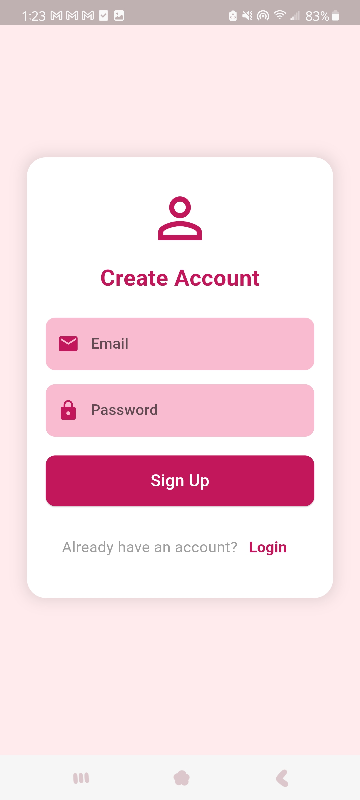

### شاشة استعادة كلمة المرور
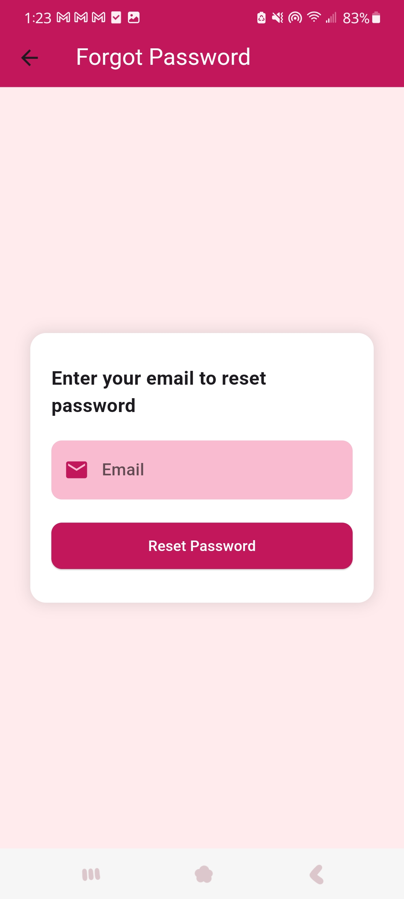

### الصفحة الرئيسية
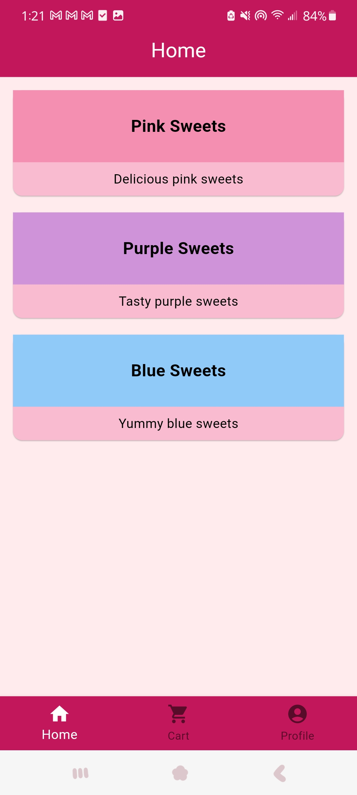

### شاشة المنتجات الوردي
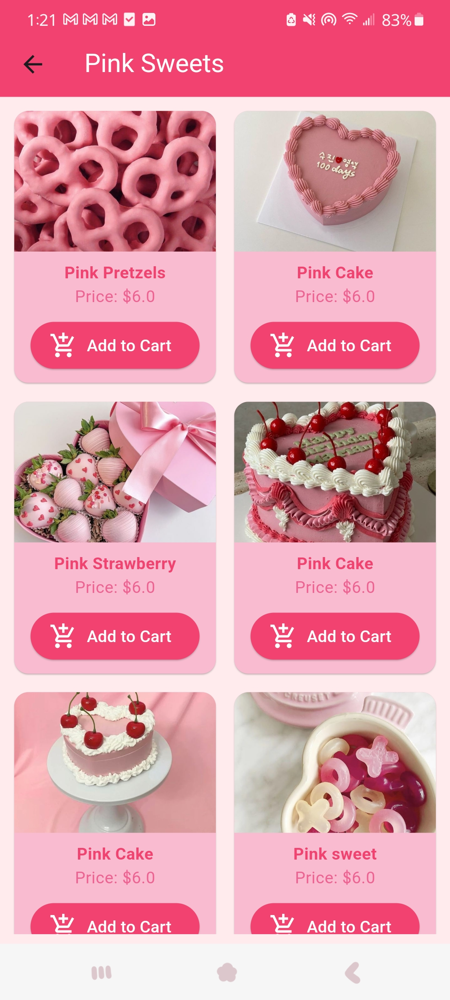

### شاشة المنتجات البنفسجي
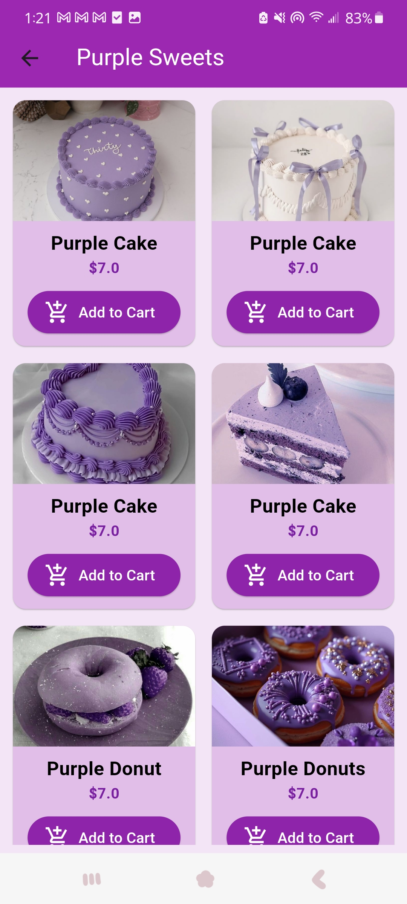

### شاشة المنتجات الأزرق
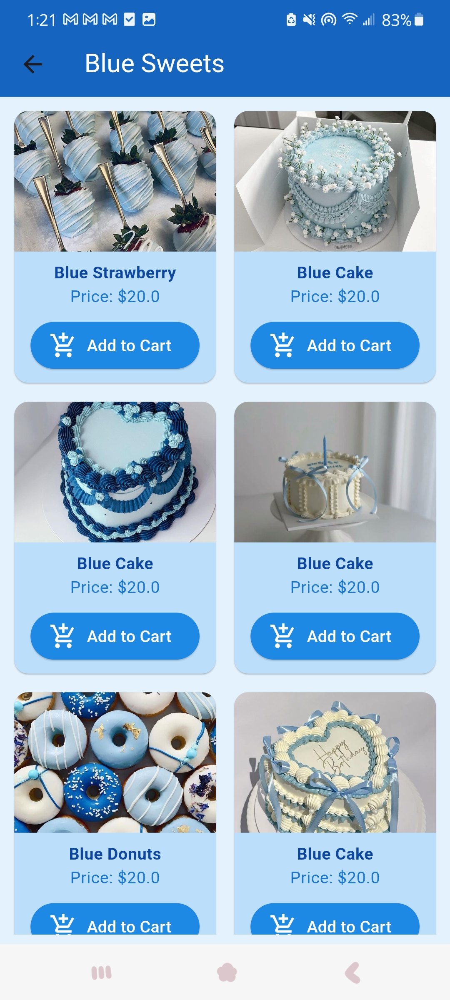

### شاشة سلة الشراء
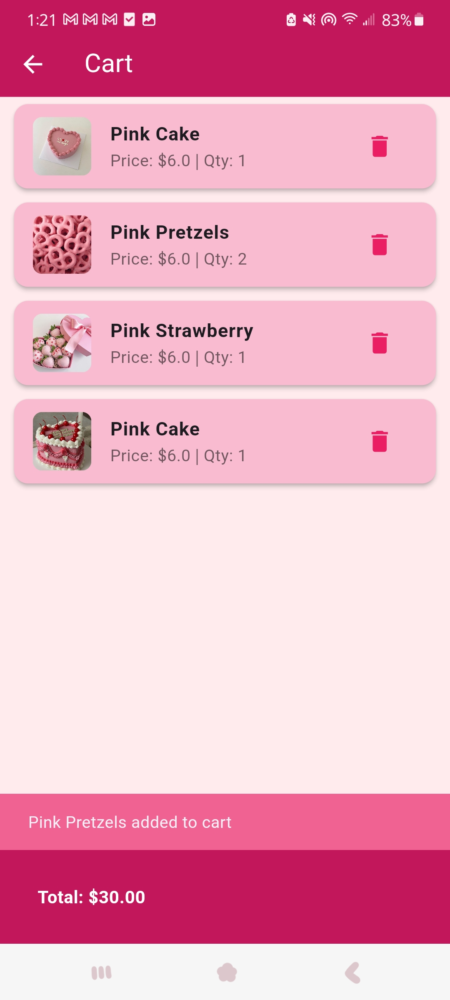

### الملف الشخصي


### لوحة التحكم
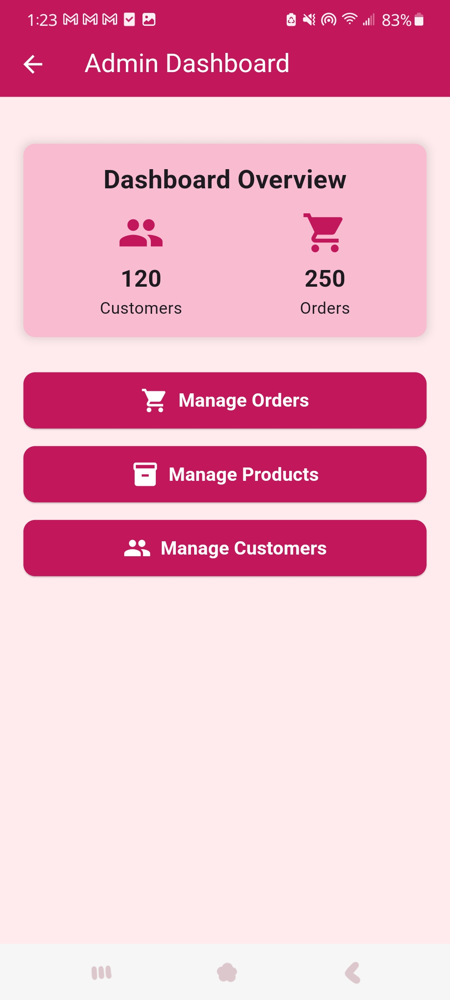

### إدارة المنتجات
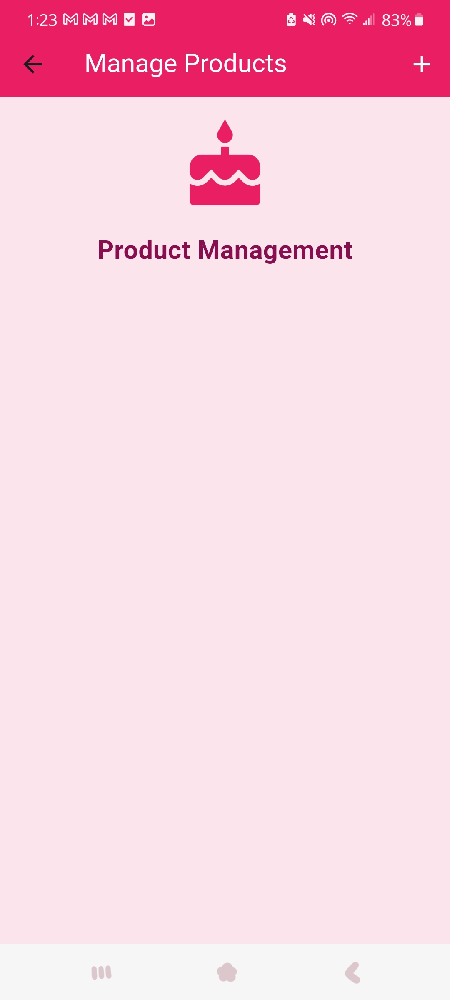

### إدارة الطلبات
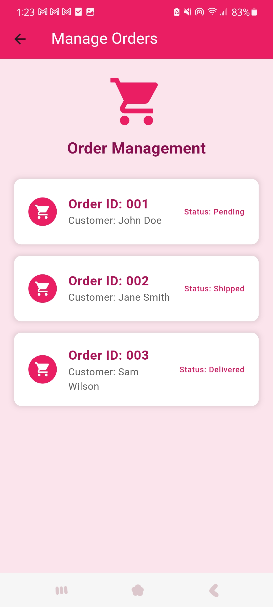

### إدارة المستخدمين
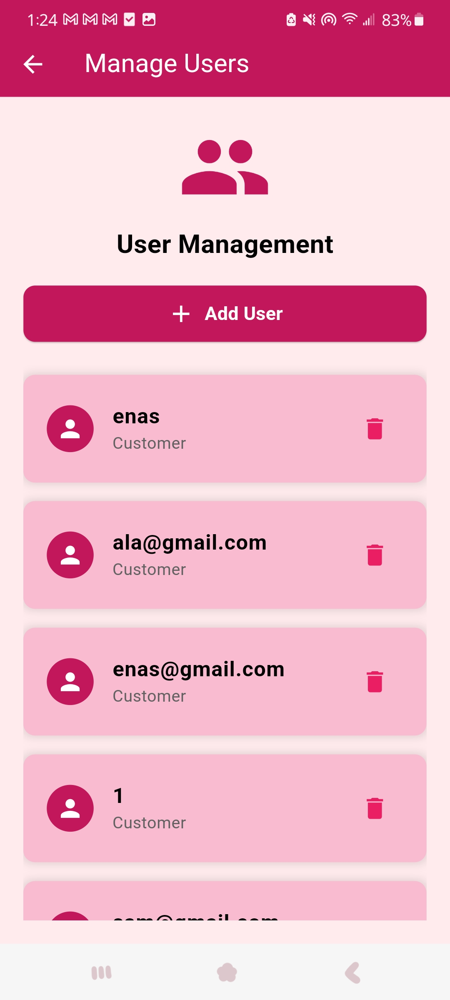

---
## 🚧 قيد التطوير (Coming Soon)

- 🔲 نظام دفع إلكتروني
- 🔲 إشعارات الدفع (Push Notifications)
- 🔲 الاتصال بالسحاب (Firebase)

---

## 🚀 كيفية تشغيل المشروع

1. التأكد من تثبيت Flutter SDK
2. تشغيل الأوامر:

```bash
flutter pub get
flutter run

##👩‍💻 صاحب المشروع

Enas Al-Hammadi  
طالبة تكنولوجيا المعلومات - السنة الرابعة  
الجامعة الإماراتية الدولية

---

## 📅 تاريخ الإنجاز

2024 - 2025
